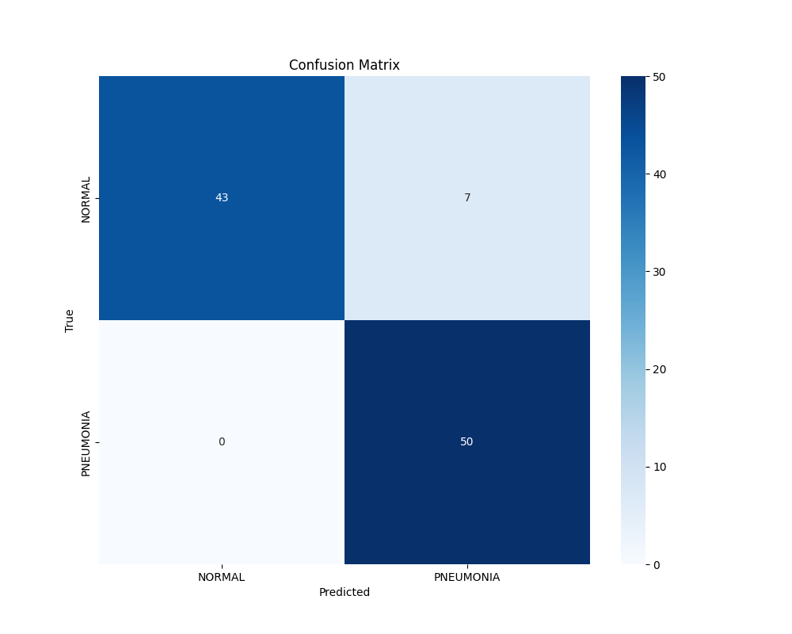

# Pediatric Pneumonia Chest X-ray Classifier with ResNet50

This project implements a pediatric pneumonia classifier using chest X-ray images with Transfer Learning and Fine-Tuning from a pre-trained ResNet50 model on ImageNet. The training process is optimized with the AdamP optimizer, and Label Smoothing is applied to improve generalization.

## Dataset Structure

The dataset should be organized in the following structure:
```
dataset/
  train/
    normal/
    pneumonia/
  val/
    normal/
    pneumonia/
  test/
    normal/
    pneumonia/
```
You can add more categories if needed, but the dataset should maintain this structure for training and evaluation.

## Results

- **Test Accuracy**: 93.0%
- **Validation Loss**: Stabilized at a low value due to Early Stopping.
- **Confusion Matrix**: Saved as `confusion_matrix.png`.

- **Classification Report**: Generated with precision, recall, and F1-score metrics.
- **Activation Map Visualization**: Generated for test samples from the last layers of ResNet50.

## Implementation

The model follows these steps:

1. **Preprocessing**:
   - Data augmentation in training: random cropping, rotation, Gaussian blur, and normalization.
   - Resizing and normalization in validation and testing.
   - All images are resized to **224x224** pixels.

2. **Transfer Learning with ResNet50**:
   - Loads pre-trained weights from ImageNet.
   - Replaces the fully connected layer with a new one matching the number of classes.
   - Initially, only the new layer is trainable.

3. **Fine-Tuning**:
   - From epoch 4 onwards, all layers are unlocked, and the learning rate is reduced for refinement.
   - CosineAnnealingLR scheduler dynamically adjusts the learning rate.

4. **Evaluation**:
   - Computes loss and accuracy on the test set.
   - Generates a confusion matrix (`confusion_matrix.png`).
   - Provides a detailed classification report.
   - Displays activation maps from the final layers.

## Training Parameters

The model is trained with the following hyperparameters:

- **Batch Size**: 512 initially, reduced to 64 for fine-tuning. This batch size was selected to maximize GPU utilization.
- **Learning Rate**: 3e-3 for initial training, 1e-4 for fine-tuning.
- **Weight Decay**: 1e-5 to prevent overfitting.
- **Label Smoothing**: 0.1 to improve generalization.
- **Scheduler**: CosineAnnealingLR with `T_max=20`, `eta_min=1e-7`.
- **Early Stopping**: Stops training if validation loss doesn't improve for 10 epochs.
- **Warmup**: Initial learning rate adjustment for stable training.

## Hardware Used

The training was performed on the following hardware:
- **GPU**: NVIDIA RTX 3070 (8GB VRAM)
- **RAM**: 64GB
- **Processor**: Intel i7-11700K

## Requirements

To run this project, install the following dependencies:

```bash
pip install -r requirements.txt
```

File `requirements.txt`:
```txt
adamp==0.3.0
matplotlib==3.7.2
numpy==1.24.4
scikit_learn==1.3.2
seaborn==0.13.2
torch==2.0.1
torchvision==0.15.2
tqdm==4.66.1
```

## Usage

### Training
Run the training script with:
```bash
python main.py
```
The model will train for a maximum of 100 epochs with Early Stopping enabled.

### Evaluation
To evaluate the model on the test set, use:
```bash
python test.py
```
Results will be logged in `test.log`, and the confusion matrix will be generated.

## Main Files

- `main.py`: Main training script.
- `test.py`: Model evaluation and report generation.
- `training.log`: Training process log.
- `test.log`: Test results log.
- `confusion_matrix.png`: Generated confusion matrix.
- `best_resnet50_transfer_learning.pth`: Saved best model weights.

## Contributions
Improvements and optimizations are welcome. To contribute, fork the repository, make your changes, and open a Pull Request.

---

This project demonstrates how to apply Transfer Learning and Fine-Tuning to medical images to achieve high accuracy in pediatric pneumonia classification using chest X-rays.

